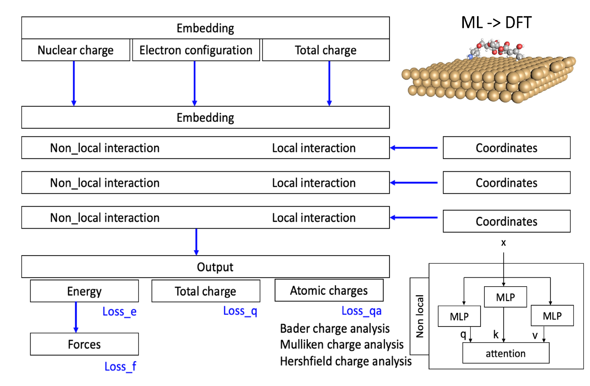
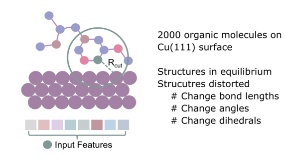

# HorseNet_0217

Develop neural network interatomic potential to predict energies and forces with accuracy comparable to DFT calculations. 

The system we majorly focus on is various molecules adsorbed on the Cu(111) or Cu(100) surface. The basic framework is based on Nequip, we introduced attention modules to consider charges. We obtained 1777 DFT calculations with 3D coordinates, energies and forces available from VASP. In addition, we tested PhysNet, SpookNet, MACE.

